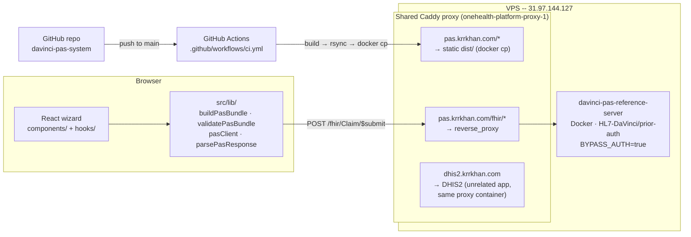
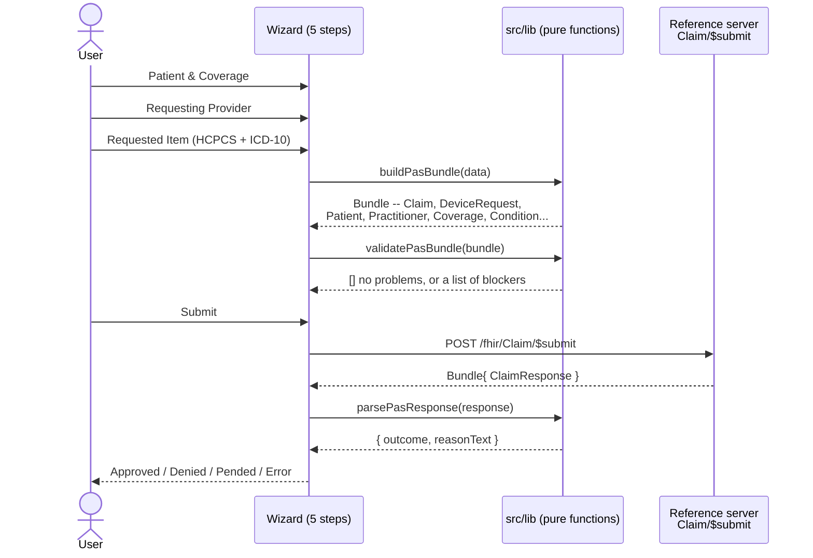

# Da Vinci PAS Prior Authorization System

Live at [pas.krrkhan.com](https://pas.krrkhan.com) &middot; [About page](https://pas.krrkhan.com/about)

## What this is and isn't

A provider/requester-side client for the [Da Vinci Prior Authorization Support (PAS)](https://build.fhir.org/ig/HL7/davinci-pas/index.html) FHIR IG -- it builds a spec-conformant request Bundle, calls `Claim/$submit`, and parses the response into a plain approved / denied / pended / error outcome. It does **not** implement the payer side (adjudication logic, X12 278 mapping) -- that's a self-hosted instance of the official [HL7-DaVinci/prior-auth](https://github.com/HL7-DaVinci/prior-auth) reference implementation.

## Why this scope

Built deliberately outside DHIS2/public-health work to demonstrate FHIR interoperability in a different domain: US payer/provider prior authorization, one of the most in-demand FHIR skill areas in US health IT right now, driven by real CMS interoperability mandates. Scoped to weeks, not months -- a working client against one concrete workflow, not a general-purpose PAS platform.

## System architecture

Everything runs on one VPS, sharing infrastructure with other apps rather than standing up dedicated infra per project:



- **The client** (this repo) is a static Vite/React build -- no server-side code of its own. All FHIR logic lives in `src/lib/` as pure, unit-tested functions; `src/hooks/` bridges them into React state; `src/components/` is presentation only.
- **The payer side** is a separate Docker container running the official reference implementation, reachable only inside the VPS's Docker network (never exposed on its own public port) -- Caddy is the only thing that talks to it directly.
- **`dhis2.krrkhan.com` shares the same Caddy container** as this app (a pre-existing multi-tenant setup, not something built for this project) -- see [Deploying](#deploying-a-real-gotcha-found-by-actually-doing-it) for what that constrains.
- **CI/CD** is push-to-deploy: every push to `main` on GitHub runs the test suite, then builds and ships straight to production. There's no staging environment.

## Workflow: how a request actually moves through the system



The one concrete workflow built end to end: a DME (Durable Medical Equipment) prior-auth request for a knee orthosis (HCPCS `L1833`) via `DeviceRequest`, tied to an ICD-10-coded `Condition`. Chosen because it's a commonly cited real-world PAS example (recurs in HL7 Connectathon test scripts) and keeps the resource graph small enough to reason about end to end.

What the assembled Bundle actually contains: one `Claim` (referencing patient/coverage/provider, plus `prescription`/`diagnosis` pointing at the DeviceRequest and Condition) alongside `DeviceRequest`, `Patient`, `Practitioner`, `PractitionerRole`, two `Organization`s (payor and requesting provider), `Coverage`, and `Condition` -- nine resources, one request.

## Two real bugs found only by testing against the live reference server

Both confirmed by directly reading the reference server's own source and test fixtures, not guessed:

1. **Bundle-local references**: `urn:uuid:...` references (the more common FHIR pattern) are rejected by this specific server with `"Unknown resource type urn:uuid:..."`. Its own test fixture (`src/test/resources/bundle-prior-auth.json`) uses `{ResourceType}/{id}`-style relative references instead -- that's what `src/lib/fhirRef.ts` produces.
2. **`Claim.prescription`/`Claim.diagnosis`, not `supportingInfo`**: the reference server links a Claim to its DeviceRequest and Condition via the standard `prescription` and `diagnosis` fields, confirmed against the same fixture -- an earlier `supportingInfo`-based linkage submitted successfully but wasn't the shape the server's own tests expect.

## Auth: BYPASS_AUTH, not a full OAuth client

`Claim/$submit` enforces SMART Backend Services OAuth2 (`client_credentials` + signed JWT assertion) by default -- building a full JWT-signing client was out of scope for this pass. Since this is a self-hosted, single-tenant instance, the deployed container runs with `BYPASS_AUTH=true` (a real env var read directly in the reference implementation's own `AuthUtils.java`), which is the honest tradeoff documented here rather than a workaround hidden in client code.

## Tradeoffs, explicitly

- Lightweight structural validation (`validatePasBundle.ts`) only -- required resources present, no dangling references, unique `fullUrl`s. Not full FHIR profile or terminology validation.
- No DTR (Documentation Templates and Rules) step yet -- the IG allows submitting without one; a hardcoded stand-in Questionnaire is a planned follow-up, not built here.
- Self-hosted reference server, not a public hosted demo -- the two candidate public sandboxes (`sandbox.logicahealth.org` and its PAS subdomain) were confirmed retired (November 2024) before this was built.
- Auth is bypassed on the reference server rather than a full JWT-bearer client implemented -- correct for a single-tenant demo, not representative of a production payer integration.

## Deploying: a real gotcha found by actually doing it

`pas.krrkhan.com` is served by a Caddy instance shared with `dhis2.krrkhan.com` and other apps on the same VPS, running as its own Docker Compose stack (`onehealth-platform`). That compose file only bind-mounts a fixed list of host paths into the proxy container -- adding a new one requires recreating the container, which would briefly interrupt every site it fronts, not just this one.

To avoid that, this app's static files are placed with `docker cp` directly into the running container's writable layer instead of a real bind mount. That's a real, documented tradeoff: those files don't survive the container being recreated for an unrelated reason (e.g. someone updates `onehealth-platform` itself) -- on that event, redeploy this app once via `git push` (or manually via the same `docker cp` step in `.github/workflows/ci.yml`) to restore them. The proper long-term fix is adding a real bind mount to `onehealth-platform`'s `compose.production.yml`, deferred until that stack needs a restart for its own reasons anyway.

GitHub Actions (`.github/workflows/ci.yml`) deploys automatically on every push to `main`: builds, `rsync`s `dist/` to `/var/www/pas-system/dist/` on the VPS (the source of truth on disk), then `docker cp`s it into the live container. Auth is a dedicated SSH keypair (not the maintainer's personal key) added only to the `shasthopath` user's `authorized_keys` -- the most restricted account available on this VPS for this purpose (root access to create a fully separate, app-scoped user wasn't available).

## Running locally

```
npm install
npm run dev
```

Points at `https://pas.krrkhan.com/fhir` by default (the live, self-hosted reference server) -- override with `VITE_PAS_SERVER_BASE` for a different target. Local Docker wasn't available in the dev environment this was built in, so there's no local reference-server option documented yet.

## Verification performed

- Unit: 28 tests across every `lib/build*.ts`, `validatePasBundle.ts`, and `parsePasResponse.ts` (`npm test`) -- all passing.
- Static: `npx tsc -b` clean, `npm run build` succeeds.
- Live, end to end (`scripts/verify-live-submit.ts`, since no browser automation tool was available in the session this was built in to click through the wizard UI directly): a real submit against `https://pas.krrkhan.com/fhir/Claim/$submit` returned a genuine `ClaimResponse` (`outcome: "queued"`, `disposition: "Pending"`), correctly parsed as `pended`.
- Not yet run: the deliberately-invalid-submission check (missing Coverage rejected server-side) and a literal browser click-through of the wizard.

## Not yet done -- honest gaps

- Real DTR/CQL logic (hardcoded Questionnaire stand-in only, and not yet built).
- Full FHIR profile/terminology validation.
- Requested-item types beyond the one DME/`DeviceRequest` example.
- A production-grade OAuth2 client (currently relies on the reference server's `BYPASS_AUTH` flag).
- Payer-side implementation -- out of scope by design.
- Browser click-through of the wizard (verified via script instead, see above).
- A real bind-mounted deploy target instead of `docker cp` into the shared proxy container's writable layer (see "Deploying" above).

## License

MIT
